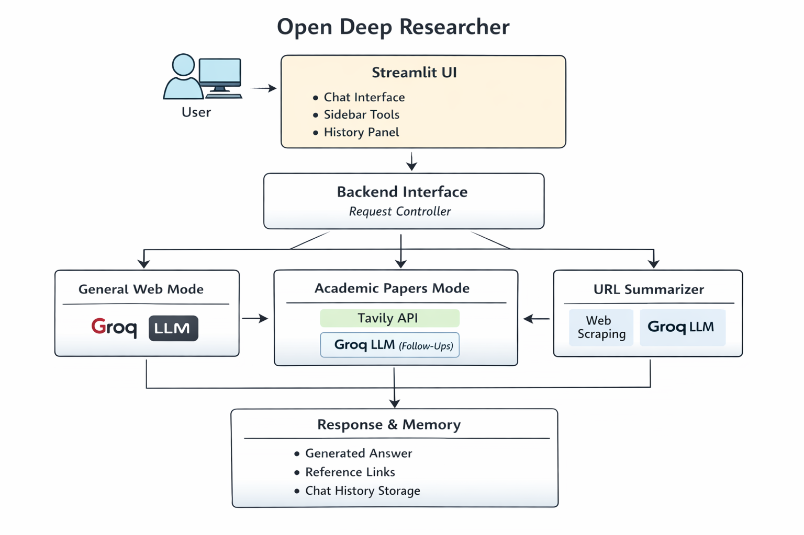
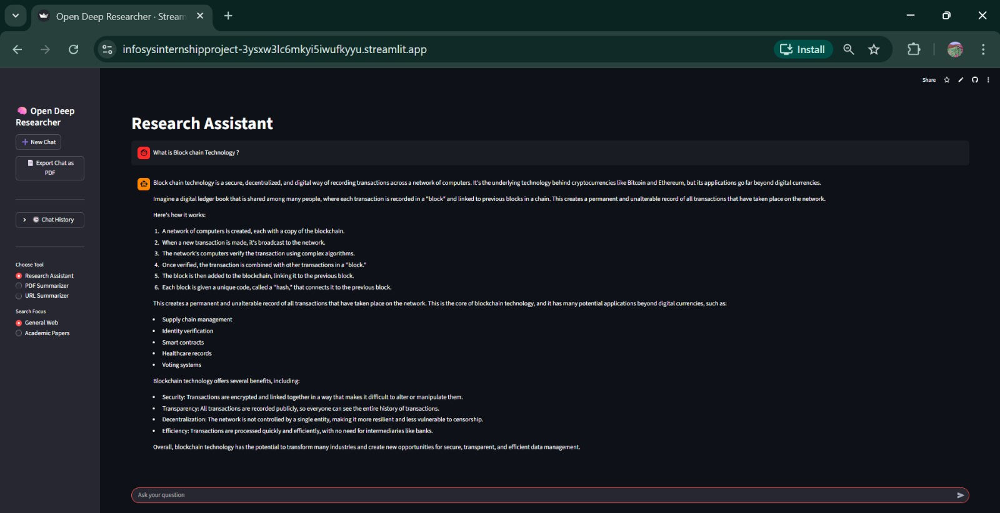
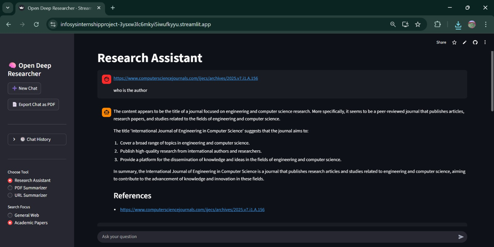
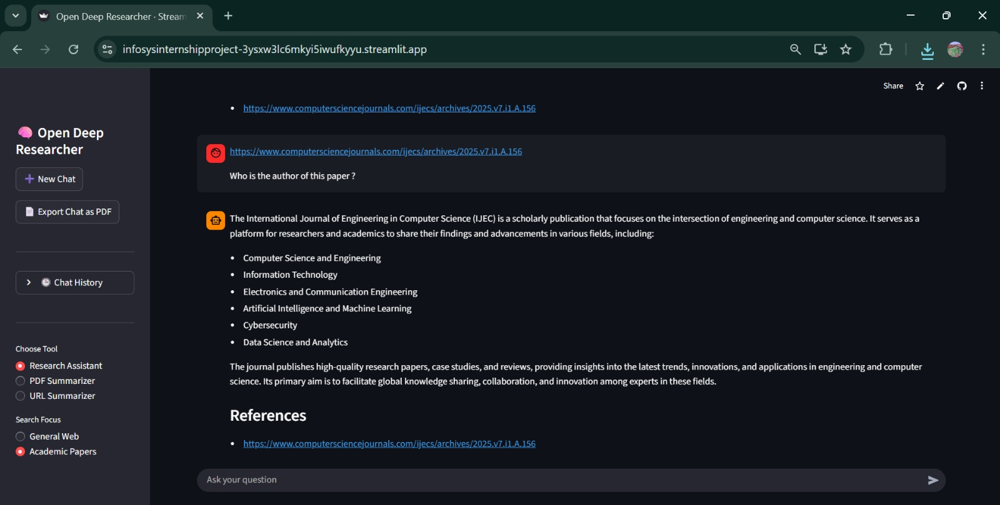
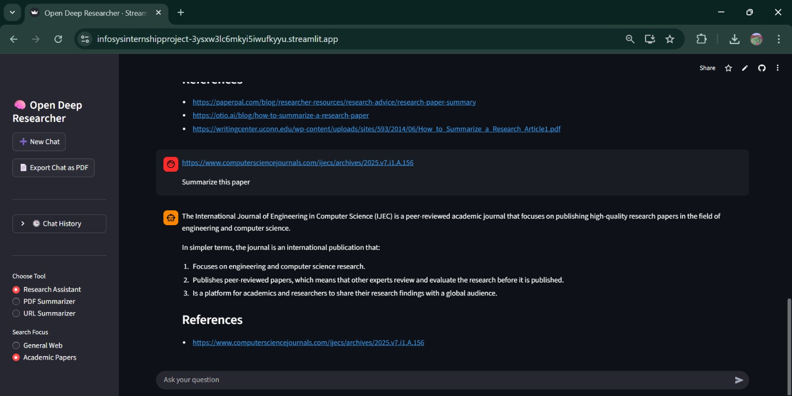
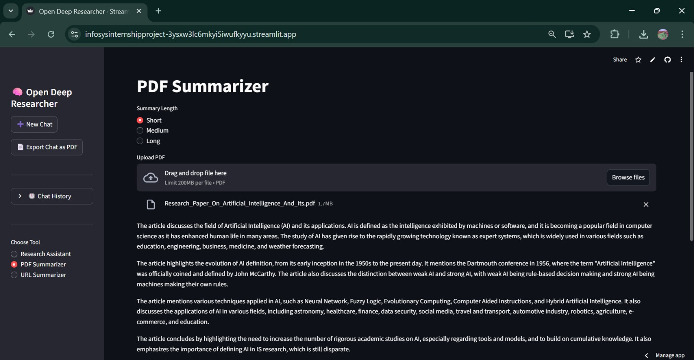
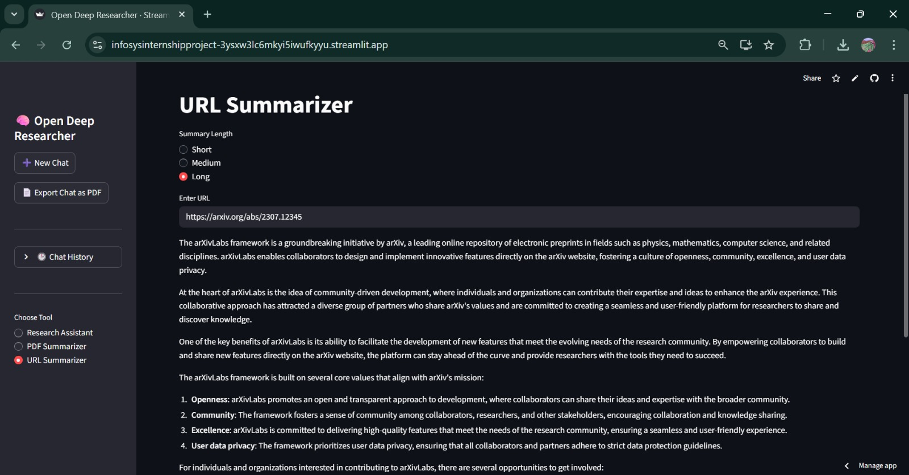

#  Open Deep Researcher – AI Research Assistant

---

## **1. Project Title**

**Open Deep Researcher – A Context-Aware AI Research Assistant**

---

## **2. Project Overview **

**Open Deep Researcher** is an AI-powered research assistant designed to help users explore topics, analyze academic papers, and summarize documents through an interactive chat-based interface.

**Key objectives of the project:**
- Provide accurate answers using general web knowledge
- Enable academic paper discovery and analysis
- Support context-aware follow-up questions
- Allow PDF and URL summarization
- Maintain chat history for continuity

---

## **3. Software and Hardware Dependencies**

### **Software Dependencies**

- **Programming Language**
  - Python 3.10+

- **Libraries & Frameworks**
  - Streamlit – Frontend UI
  - LangChain & LangChain-Groq – LLM orchestration
  - Tavily API – Academic paper search
  - BeautifulSoup4 – Web scraping
  - PyPDF2 – PDF text extraction
  - ReportLab – Export chat as PDF
  - Requests – HTTP requests
  - python-dotenv – Environment variable handling

- **APIs Used**
  - Groq API – Language model inference
  - Tavily API – Research paper retrieval

### **Hardware Dependencies**

- Minimum 4 GB RAM
- No GPU required
- Works on standard laptops/desktops

---

## **4. Architecture Diagram**

---

## **5. Workflow**

**Step-by-step system workflow:**
- User selects a mode (General Web / Academic Papers / PDF / URL)
- User provides input (query, PDF, or URL)
- Backend identifies query type and context
- Relevant tool or agent is invoked
- LLM generates a response
- Output is displayed and stored in chat history

---

## **6. Agent Roles (Brief Explanation)**

- **Planner**
  - Determines whether the query is a new search or a follow-up
  - Decides when to invoke search tools or reuse context

- **Executor / Writer**
  - Uses Groq LLM to generate answers and summaries
  - Ensures responses are concise and context-aware

- **Agent Pipeline**
  - UI → Backend Controller → Tools / LLM → Response
  - Maintains conversational memory across interactions

---

## **7. Sample Working Demo (Optional)**

**Example interaction (Academic Papers mode):**
- *User:* What are recent methods for diabetes prediction?
- *Assistant:* Provides answer with references
- *User:* Summarize the first paper
- *Assistant:* Summarizes only the selected paper

---

## **8. Outputs / Results**

The system produces:
- Conversational answers
- Academic research summaries
- Reference links to papers
- PDF summaries (short / medium / long)
- URL content summaries
- Exportable chat history as PDF

### General Web Mode Output

### Academic Papers Mode Output

### PDF Summarization Output

### URL Summarization Output

---

## **9. Limitations**

- Academic results depend on Tavily API coverage
- Very large PDFs may be truncated
- Web page structure can affect URL extraction
- Multilingual support is not yet implemented

---

## **10. Future Enhancements**

- User authentication and personalized history
- Support for additional academic databases
- Multi-document analysis
- Improved citation formatting (APA / IEEE)
- Advanced agent reasoning using LangGraph
- Offline document indexing

---

## **11. Deployed Project Link**

 **Live Application:**  
   *https://infosysinternshipproject-3ysxw3lc6mkyi5iwufkyyu.streamlit.app/*

---

## **12. Short Project Summary**

- AI-powered research assistant with chat-based interaction  
- Supports web answers, academic papers, PDF and URL summarization  

---
